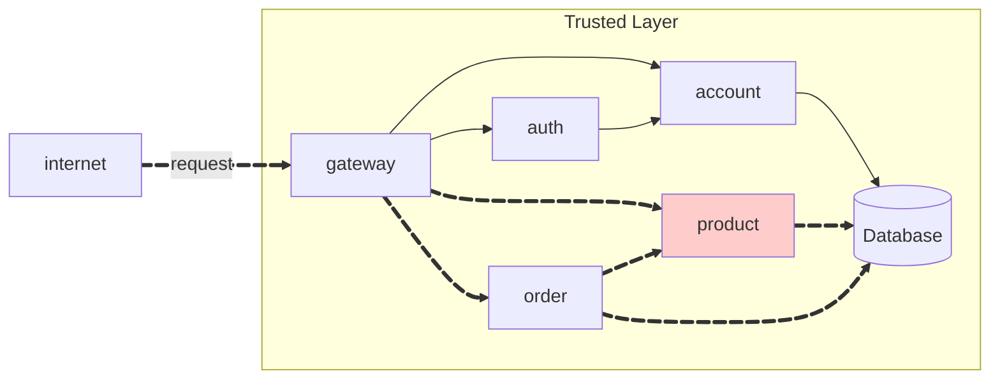

## PRODUCT API

- Feito por Lucas Abatepietro



## Tarefas

1. Implementar um microserviço **PRODUCT** que contenha:
   - POST/product: cria um produto
   - GET/product: pega todos os produtos
   - GET/product/{id}: pega um produto pelo ´id´
   - DELETE/product/{id}: deleta um produto dado um id

- O serviço foi implementado em Java utilizando:
  - Spring Boot
  - Spring Data JPA
  - Spring Cloud OpenFeign para comunicação.
  - Banco de dados: PostgreSQL.

## Endpoints implementados

Foram implementados os seguintes endpoints com request body e response da seguinte forma:

!!! info "POST /product"
Cria um novo produto

=== "Request"

    ```{ .json .copy .select linenums='1' }
    {
      "name": "Milho",
      "price": 69,
      "unit": "Ton"
    }
    ```

=== "Response"

    ```{ .json .copy .select linenums='1' }
    {
      "id": "generated-uuid",
      "name": "Milho",
      "price": 69,
      "unit": "Ton"
    }
    ```
    ```bash
    Response code: 201 (Created)
    ```

---

!!! info "GET /product"

Lista todos os produtos.

=== "Response 200"

    ```{ .json .copy .select linenums='1' }
    [
      {
        "id": "0195abfb-7074-73a9-9d26-b4b9fbaab0a8",
        "name": "Milho",
        "price": 69,
        "unit": "Ton"
      },
      {
        "id": "0195abfe-e416-7052-be3b-27cdaf12a984",
        "name": "Queijadinha",
        "price": 0.62,
        "unit": "g"
      }
    ]
    ```
    ```bash
    Response code: 200 (OK)
    ```

---

!!! info "GET /product/{id}"

Pega um produto pelo id

=== "Response 200"

    ```{ .json .copy .select linenums='1' }
    [
      {
        "id": "0195abfb-7074-73a9-9d26-b4b9fbaab0a8",
        "name": "Milho",
        "price": 69,
        "unit": "Ton"
      }
    ]
    ```
    ```bash
    Response code: 200 (OK)
    ```

---

!!! info "DELETE /product/{id}"

Deleta um produto pelo id

=== "Response"

    ```bash
    Response code: 204 (No Content)
    ```
    ```{ .json .copy .select linenums='1' }
    # Sem corpo de resposta.
    ```

## Estrutura do projeto

### Product:

```
📁 api/
└── 📁 product/
    ├── 📁 src/
    │   └── 📁 main/
    │       └── 📁 java/
    │           └── 📁 store/
    │               └── 📁 product/
    │                   ├── 📄 ProductCtrl.java
    │                   ├── 📄 ProductIn.java
    │                   └── 📄 ProductOut.java
    └── 📄 pom.xml
```

### Product-service:

```
PRODUCT SERVICE
📁 api/
└── 📁 product-service/
    ├── 📁 src/
    │   └── 📁 main/
    │       ├── 📁 java/
    │       │   └── 📁 store/
    │       │       └── 📁 product/
    │       │           ├── 📄 Product.java
    │       │           ├── 📄 ProductApp.java
    │       │           ├── 📄 ProductModel.java
    │       │           ├── 📄 ProductParser.java
    │       │           ├── 📄 ProductRepo.java
    │       │           ├── 📄 ProductReso.java
    │       │           └── 📄 ProductService.java
    │       └── 📁 resources/
    │           ├── 📄 application.yaml
    │           └── 📁 db/
    │               └── 📁 migration/
    │                   ├── 📄 schema.sql
    │                   └── 📄 table.sql
    ├── 📄 pom.xml
    └── 📄 Dockerfile
```

## Repositórios:

- [Product](https://github.com/pma2025/pma252.product)
- [Product-Service](https://github.com/pma2025/pma252.product-service)

## Conclusão

Cada enxadada uma minhoca.
