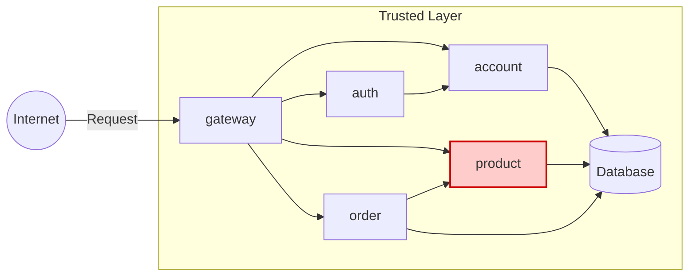

# PRODUCT API

**Feito por:** Lucas Abatepietro

---

## Arquitetura



---

## Tarefas

1. Implementar um microserviço **PRODUCT** que contenha:

   - `POST /product`: cria um produto
   - `GET /product`: retorna todos os produtos
   - `GET /product/{id}`: retorna um produto pelo `id`
   - `DELETE /product/{id}`: deleta um produto dado um `id`

2. O serviço foi implementado em **Java**, utilizando:
   - Spring Boot
   - Spring Data JPA
   - Spring Cloud OpenFeign para comunicação
   - Banco de dados: **PostgreSQL**

---

## Endpoints Implementados

Foram implementados os seguintes endpoints com request body e response da seguinte forma:

---

### **POST /product**

Cria um novo produto.

=== "Request"

```json
{
  "name": "Milho",
  "price": 69,
  "unit": "Ton"
}
```

=== "Response"

```json
{
  "id": "generated-uuid",
  "name": "Milho",
  "price": 69,
  "unit": "Ton"
}
```

```bash
Response code: 201 (Created)
```

---

### **GET /product**

Lista todos os produtos.

=== "Response 200"

```json
[
  {
    "id": "0195abfb-7074-73a9-9d26-b4b9fbaab0a8",
    "name": "Milho",
    "price": 69,
    "unit": "Ton"
  },
  {
    "id": "0195abfe-e416-7052-be3b-27cdaf12a984",
    "name": "Queijadinha",
    "price": 0.62,
    "unit": "g"
  }
]
```

```bash
Response code: 200 (OK)
```

---

### **GET /product/{id}**

Pega um produto pelo ID.

=== "Response 200"

```json
{
  "id": "0195abfb-7074-73a9-9d26-b4b9fbaab0a8",
  "name": "Milho",
  "price": 69,
  "unit": "Ton"
}
```

```bash
Response code: 200 (OK)
```

---

### **DELETE /product/{id}**

Deleta um produto pelo ID.

=== "Response"

```bash
Response code: 204 (No Content)
```

```text
# Sem corpo de resposta.
```

---

## Estrutura do Projeto

### Product

```
📁 api/
└── 📁 product/
    ├── 📁 src/
    │   └── 📁 main/
    │       └── 📁 java/
    │           └── 📁 store/
    │               └── 📁 product/
    │                   ├── 📄 ProductCtrl.java
    │                   ├── 📄 ProductIn.java
    │                   └── 📄 ProductOut.java
    └── 📄 pom.xml
```

---

### Product-Service

```
📁 api/
└── 📁 product-service/
    ├── 📁 src/
    │   └── 📁 main/
    │       ├── 📁 java/
    │       │   └── 📁 store/
    │       │       └── 📁 product/
    │       │           ├── 📄 Product.java
    │       │           ├── 📄 ProductApp.java
    │       │           ├── 📄 ProductModel.java
    │       │           ├── 📄 ProductParser.java
    │       │           ├── 📄 ProductRepo.java
    │       │           ├── 📄 ProductReso.java
    │       │           └── 📄 ProductService.java
    │       └── 📁 resources/
    │           ├── 📄 application.yaml
    │           └── 📁 db/
    │               └── 📁 migration/
    │                   ├── 📄 schema.sql
    │                   └── 📄 table.sql
    ├── 📄 pom.xml
    └── 📄 Dockerfile
```

---

## Repositórios

- [Product](https://github.com/pma2025/pma252.product)
- [Product-Service](https://github.com/pma2025/pma252.product-service)

---

## Conclusão

> Cada enxadada, uma minhoca. 🪱
