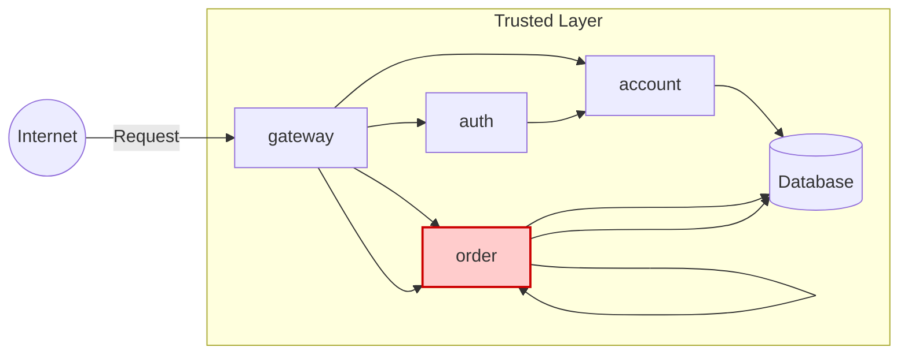

# ORDER API

**Feito por:** Lucas Abatepietro

---

## Arquitetura



---

## Tarefas

Implementar um microserviço **ORDER** que tenha os seguintes requisitos:

- `POST /order`: cria um pedido
- `GET /order`: lista todos os pedidos
- `GET /order/{id}`: busca pedido por ID

Este serviço segue o padrão adotado no projeto: **interface** (`order`) e **service** (`order-service`), posicionados atrás do **gateway** e protegidos por **JWT**.

---

## Estrutura do Projeto

### Order

```
📁 api/
└── 📁 order/
    ├── 📁 src/
    │   └── 📁 main/
    │       └── 📁 java/
    │           └── 📁 store/
    │               └── 📁 order/
    │                   ├── 📄 OrderController.java
    │                   ├── 📄 OrderIn.java
    │                   ├── 📄 OrderOut.java
    │                   ├── 📄 OrderItemIn.java
    │                   └── 📄 OrderItemOut.java
    └── 📄 pom.xml
```

---

### Order-Service

```
📁 api/
└── 📁 order-service/
    ├── 📁 src/
    │   └── 📁 main/
    │       ├── 📁 java/
    │       │   └── 📁 store/
    │       │       └── 📁 order/
    │       │           ├── 📄 Order.java
    │       │           ├── 📄 OrderItem.java
    │       │           ├── 📄 OrderApp.java
    │       │           ├── 📄 OrderModel.java
    │       │           ├── 📄 OrderParser.java
    │       │           ├── 📄 OrderRepo.java
    │       │           ├── 📄 OrderResource.java
    │       │           ├── 📄 OrderService.java
    │       │           └── 📄 FeignAuthInter.java
    │       └── 📁 resources/
    │           ├── 📄 application.yaml
    │           └── 📁 db/
    │               └── 📁 migration/
    │                   ├── 📄 schema.sql
    │                   ├── 📄 create_table.sql
    │                   └── 📄 orderitem.sql
    ├── 📄 pom.xml
    └── 📄 Dockerfile
```

---

## Endpoints Implementados

### **POST /order**

Cria um novo pedido.

=== "Request"

```json
{
  "items": [
    {
      "idProduct": "0195abfb-7074-73a9-9d26-b4b9fbaab0a8",
      "quantity": 2
    },
    {
      "idProduct": "0195abfe-e416-7052-be3b-27cdaf12a984",
      "quantity": 1
    }
  ]
}
```

=== "Response"

```json
{
  "id": "0195ac33-73e5-7cb3-90ca-7b5e7e549569",
  "date": "2025-09-01T12:30:00",
  "items": [
    {
      "id": "01961b9a-bca2-78c4-9be1-7092b261f217",
      "product": { "id": "0195abfb-7074-73a9-9d26-b4b9fbaab0a8" },
      "quantity": 2,
      "total": 20.24
    },
    {
      "id": "01961b9b-08fd-76a5-8508-cdb6cd5c27ab",
      "product": { "id": "0195abfe-e416-7052-be3b-27cdaf12a984" },
      "quantity": 10,
      "total": 6.2
    }
  ],
  "total": 26.44
}
```

```bash
Response code: 201 (Created)
Response code: 400 (Bad Request) — se o produto não existir.
```

---

### **GET /order**

Lista todos os pedidos.

=== "Response 200"

```json
[
  {
    "id": "0195ac33-73e5-7cb3-90ca-7b5e7e549569",
    "date": "2025-09-01T12:30:00",
    "total": 26.44
  },
  {
    "id": "0195ac33-cbbd-7a6e-a15b-b85402cf143f",
    "date": "2025-10-09T03:21:57",
    "total": 18.6
  }
]
```

```bash
Response code: 200 (OK)
```

---

### **GET /order/{id}**

Busca pedido pelo ID.

=== "Response 200"

```json
{
  "id": "0195ac33-73e5-7cb3-90ca-7b5e7e549569",
  "date": "2025-09-01T12:30:00",
  "items": [
    {
      "id": "01961b9a-bca2-78c4-9be1-7092b261f217",
      "product": { "id": "0195abfb-7074-73a9-9d26-b4b9fbaab0a8" },
      "quantity": 2,
      "total": 20.24
    },
    {
      "id": "01961b9b-08fd-76a5-8508-cdb6cd5c27ab",
      "product": { "id": "0195abfe-e416-7052-be3b-27cdaf12a984" },
      "quantity": 10,
      "total": 6.2
    }
  ],
  "total": 26.44
}
```

```bash
Response code: 200 (OK)
Response code: 404 (Not Found) — se o pedido não pertencer ao usuário atual.
```

---

## Repositórios

- [Order](https://github.com/pma2025/pma252.order)
- [Order-Service](https://github.com/pma2025/pma252.order-service)

---

## Conclusão

> Cada enxadada, uma minhoca. 🪱
