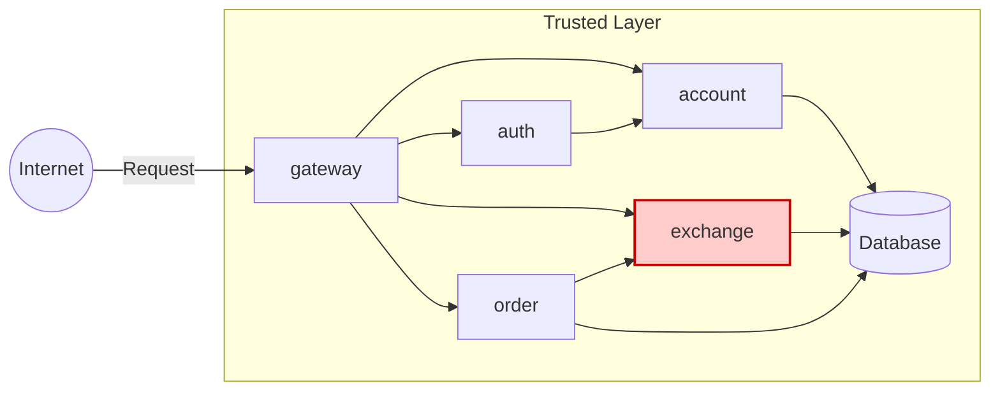

# EXCHANGE API

**Feito por:** Lucas Abatepietro

---

## Arquitetura



---

## Tarefas

Implementar um microserviço desenvolvido em **FastAPI**, responsável por consultar um provedor externo de câmbio e aplicar regras de spread.

- A API utiliza o [**ExchangeRate-API**](https://www.exchangerate-api.com/) para obter o preço atual das trocas entre moedas (câmbio).

---

## Estrutura do Projeto

### Exchange-Service

```
📁 api/
└── 📁 exchange-service/
    ├── 📁 app/
    │   ├── 📄 main.py
    │   ├── 📄 auth.py
    │   ├── 📄 config.py
    │   ├── 📄 models.py
    │   └── 📄 rates.py
    ├── 📄 requirements.txt
    └── 📄 Dockerfile
```

---

## Endpoint Implementado

### **GET /exchange/{from}/{to}**

Retorna a taxa de câmbio entre duas moedas.

=== "Response"

```json
{
  "sell": 0.82,
  "buy": 0.8,
  "date": "2021-09-01 14:23:42",
  "id-account": "0195ae95-5be7-7dd3-b35d-7a7d87c404fb"
}
```

```bash
Response code: 200 (OK)
```

---

## Repositórios

- [Exchange-Service](https://github.com/pma2025/pma252.exchange-service)

---

## Conclusão

> Cada enxadada, uma minhoca. 🪱
