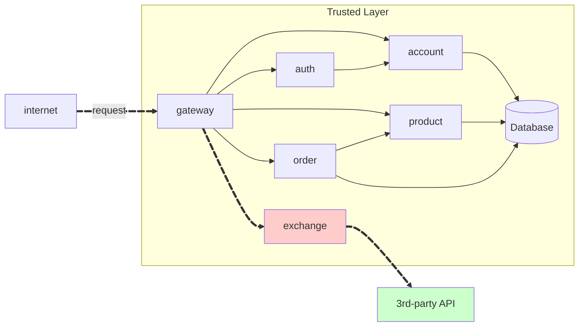

### Exchange API

- feito por Lucas Abatepietro

## Estrutura da requisição



## Tarefas:

Implementar um microserviço implementado em **FastAPI**, que consulta um provedor externo de câmbio e aplica regras de spread.

- essa API usa o [ExchangeRate-API](https://www.exchangerate-api.com/) para pegar o preço atual das trocas entre moedas (câmbio)

## Estrutura do projeto

### Exchange-Service

```tree
api/
    exchange-service/
        app/
            __init__.py
            main.py
            auth.py
            config.py
            models.py
            clients/
                __init__.py
                rates.py
        requirements.txt
        Dockerfile
```

## Endpoint:

!!! info "GET/exchange/{from}/{to}"

    Pega a taxa de câmbio de uma moeda para outro.

    === "Response"

        ``` { .json .copy .select linenums='1' }
            {
                "sell": 0.82,
                "buy": 0.80,
                "date": "2021-09-01 14:23:42",
                "id-account": "0195ae95-5be7-7dd3-b35d-7a7d87c404fb"
            }
        ```
        ```bash
        Response code: 200 (ok)
        ```

## Main.py:

=== "main.py"

    ```

from datetime import datetime
from os import getenv
from typing import Optional

import httpx
from fastapi import FastAPI, Header, HTTPException, status
from pydantic import BaseModel, Field, validator

app = FastAPI(
title="Exchange-Service",
version="1.0.0",
description="Converts currency pairs using https://www.exchangerate-api.com/",
)

API_KEY: str | None = getenv("EXCHANGE_API_KEY")
BASE_URL = f"https://v6.exchangerate-api.com/v6/{API_KEY}/pair"

class ExchangeOut(BaseModel):
sell: float = Field(..., description="Rate to SELL <from> and receive <to>")
buy: float = Field(..., description="Rate to BUY <from> paying <to>")
date: str = Field(..., description="UTC timestamp of the quote")
id_account: Optional[str] = Field(None, alias="id-account")

    @validator("date", pre=True)
    def _format_date(cls, v) -> str:
        if isinstance(v, datetime):
            return v.strftime("%Y-%m-%d %H:%M:%S")
        return v

@app.get(
"/exchange-rate/{from_curr}/{to_curr}",
response_model=ExchangeOut,
summary="Get FX quote",
)
async def get_exchange_rate(
from_curr: str,
to_curr: str,
id_account: str | None = Header(default=None, alias="Id-Account"),
):
if not API_KEY:
raise HTTPException(
status_code=status.HTTP_500_INTERNAL_SERVER_ERROR,
detail="Exchange API key not configured (EXCHANGE_API_KEY).",
)

    url = f"{BASE_URL}/{from_curr.upper()}/{to_curr.upper()}"

    async with httpx.AsyncClient(timeout=6.0) as client:
        try:
            r = await client.get(url)
        except httpx.HTTPError as exc:
            raise HTTPException(
                status_code=status.HTTP_502_BAD_GATEWAY,
                detail=f"Upstream error: {exc}",
            )

    if r.status_code != 200:
        raise HTTPException(
            status_code=status.HTTP_502_BAD_GATEWAY,
            detail=f"Provider returned {r.status_code}: {r.text}",
        )

    data = r.json()
    if data.get("result") != "success":
        raise HTTPException(
            status_code=status.HTTP_400_BAD_REQUEST,
            detail=f"Provider error: {data.get('error-type')}",
        )

    rate = float(data["conversion_rate"])
    sell = round(rate * 0.99, 6)
    buy  = round(rate * 1.01, 6)

    return ExchangeOut(
        sell=sell,
        buy=buy,
        date=datetime.utcnow(),
        id_account=id_account,
    )
    ```

## Repositorios:

[Exchange-Service](https://github.com/pma2025/pma252.exchange-service)

## Conclusão

Cada enxadada uma minhoca.
