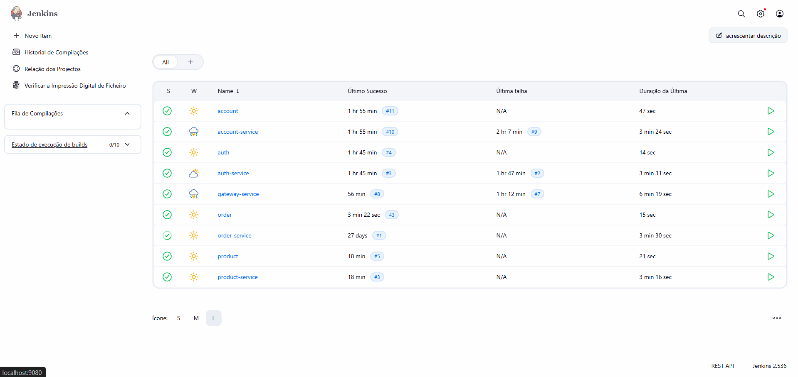

# CI/CD Com Jenkins
* Desenvolvido por:
    * Lucas Abatepietro
    * Marcelo Alonso
    * Henrique Bucci

## Como implementamos isso?

### 1. ```compose.yaml``` do Jenkinsfile

tivemos que mudar o ```compose.yaml``` do **Jenkinsfile** para instalar a *aws* corretamente, sendo possível conectar com nosso serviço. Ficando da seguinte forma:

```yaml
# docker compose up -d --build --force-recreate
name: ops

services:

  jenkins:
    container_name: jenkins
    build:
      dockerfile_inline: |
        FROM jenkins/jenkins:jdk21
        USER root

        # Install tools
        RUN apt-get update && apt-get install -y lsb-release iputils-ping maven

        # Install Docker
        RUN curl -fsSLo /usr/share/keyrings/docker-archive-keyring.asc \
          https://download.docker.com/linux/debian/gpg
        RUN echo "deb [arch=$(dpkg --print-architecture) \
          signed-by=/usr/share/keyrings/docker-archive-keyring.asc] \
          https://download.docker.com/linux/debian \
          $(lsb_release -cs) stable" > /etc/apt/sources.list.d/docker.list
        RUN apt-get update && apt-get install -y docker-ce

        # Install kubectl
        RUN apt-get install -y apt-transport-https ca-certificates curl
        RUN curl -fsSL https://pkgs.k8s.io/core:/stable:/v1.30/deb/Release.key | gpg --dearmor -o /etc/apt/keyrings/kubernetes-apt-keyring.gpg
        RUN chmod 644 /etc/apt/keyrings/kubernetes-apt-keyring.gpg
        RUN echo 'deb [signed-by=/etc/apt/keyrings/kubernetes-apt-keyring.gpg] https://pkgs.k8s.io/core:/stable:/v1.30/deb/ /' | tee /etc/apt/sources.list.d/kubernetes.list
        RUN chmod 644 /etc/apt/sources.list.d/kubernetes.list
        RUN apt-get update && apt-get install -y kubectl

        # Install AWS CLI
        RUN apt-get install -y unzip
        RUN curl "https://awscli.amazonaws.com/awscli-exe-linux-x86_64.zip" -o "awscliv2.zip" && \
            unzip awscliv2.zip && \
            ./aws/install && \
            rm -rf aws awscliv2.zip

        RUN usermod -aG docker jenkins
    ports:
      - 9080:8080
    volumes:
      - ${CONFIG:-./config}/jenkins:/var/jenkins_home
      - /var/run/docker.sock:/var/run/docker.sock
    restart: always
```

### 2. ```Jenkinsfile``` dos serviços

Todos os serviços tiveram a adição de uma linha de codigo no Jenkins para que seja possível enviar para a aws, onde tivemos que passar na **CREDENTIALS**:

| Credencial               | Variável de Ambiente     |
|--------------------------|---------------------------|
| aws-access-key-id        | AWS_ACCESS_KEY_ID         |
| aws-secret-access-key    | AWS_SECRET_ACCESS_KEY     |
| aws-region               | AWS_REGION                |
| eks-cluster-name         | CLUSTER_NAME              |


Além dos **CREDENTIALS** adicionados. Além disso, tivemos que alterar o ```Jenkinsfile``` de todos os serviços que ficaram da seguinte forma agora:

``` js

pipeline {
    agent any
    environment {
        SERVICE = 'order'
        NAME = "luabatepietro/${env.SERVICE}"
    }
    stages {
        stage('Dependecies') {
            steps {
                build job: 'order', wait: true
            }
        }
        stage('Build') { 
            steps {
                sh 'mvn -B -DskipTests clean package'
            }
        }      
        stage('Build & Push Image') {
            steps {
                withCredentials([usernamePassword(
                    credentialsId: 'dockerhub-credential',
                    usernameVariable: 'USERNAME',
                    passwordVariable: 'TOKEN')])
                {
                    sh "docker login -u $USERNAME -p $TOKEN"
                    sh "docker buildx create --use --platform=linux/arm64,linux/amd64 --node multi-platform-builder-${env.SERVICE} --name multi-platform-builder-${env.SERVICE}"
                    sh "docker buildx build --platform=linux/arm64,linux/amd64 --push --tag ${env.NAME}:latest --tag ${env.NAME}:${env.BUILD_ID} -f DockerFile ."
                    sh "docker buildx rm --force multi-platform-builder-${env.SERVICE}"
                }
            }
        }
        stage('Deploy to EKS') {
            steps {
                withCredentials([
                    string(credentialsId: 'aws-access-key-id', variable: 'AWS_ACCESS_KEY_ID'),
                    string(credentialsId: 'aws-secret-access-key', variable: 'AWS_SECRET_ACCESS_KEY'),
                    string(credentialsId: 'aws-region', variable: 'AWS_REGION'),
                    string(credentialsId: 'eks-cluster-name', variable: 'CLUSTER_NAME')
                ]) {
                    sh "aws eks update-kubeconfig --region ${AWS_REGION} --name ${CLUSTER_NAME}"
                    sh "kubectl set image deployment/${env.SERVICE} ${env.SERVICE}=${env.NAME}:${env.BUILD_ID} -n default"
                    sh "kubectl rollout status deployment/${env.SERVICE} -n default"
                }
            }
        }
    }
}

```

## Imagens que comprovam:

Aqui temos a imagem do **Jenkins** rodando com tudo e como ficou o **fluxo de todos os serviços**

<figure>
  
  <figcaption>Figura 1 — Tela do Jenkins com TUDO funcionando.</figcaption>
</figure>


<figure>
  
  <figcaption>Figura 2 — Fluxo do deploy de todos os exercícios.</figcaption>
</figure>
