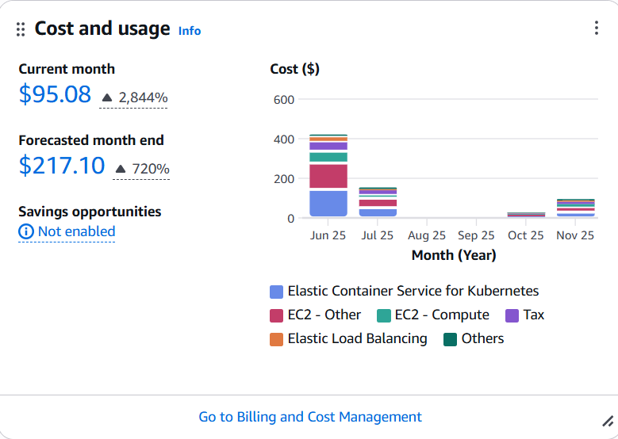
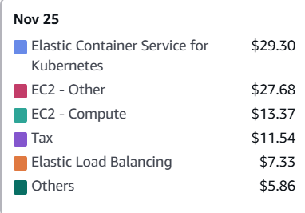

# Análise de custos

A análise de custos foi feita utilizando a aba **Cost and usage** que mostra detalhadamente onde estão indo todos os custos e qual a previsão de custos.

<figure>
  
  <figcaption>Figura 1 — Mostrando o Cost and usage do nosso microserviço</figcaption>
</figure>

### Análise detalhada:

| Serviço                                | Custo (USD) | % do Total |
|----------------------------------------|-------------|------------|
| Elastic Container Service for Kubernetes | $29.30      | 30.82%     |
| EC2 – Other                             | $27.68      | 29.11%     |
| EC2 – Compute                           | $13.37      | 14.06%     |
| Tax                                     | $11.54      | 12.14%     |
| Elastic Load Balancing                  | $7.33       | 7.71%      |
| Others                                  | $5.86       | 6.16%      |
| **Total**                               | **$95.08**  | **100%**   |

<figure>
  
  <figcaption>Figura 2 - mostrando para onde estão sendo direcionados os custos</figcaption>
</figure>

### Conclusão:

Os custos atuais do ambiente totalizam US$ 95,08, com projeção de fechamento em US$ 217,10, refletindo um uso estável e coerente da infraestrutura. A maior parte do consumo concentra-se em serviços essenciais como:
- EKS/
- ECS
- EC2
- Load Balancing,

indicando que o cluster está corretamente dimensionado e sem desperdícios relevantes. 

Em comparação com meses anteriores, observa-se uma queda significativa no gasto total, reforçando a eficiência das otimizações aplicadas.

> No geral, o ambiente demonstra equilíbrio entre desempenho e custo, com previsibilidade financeira e boa saúde operacional.